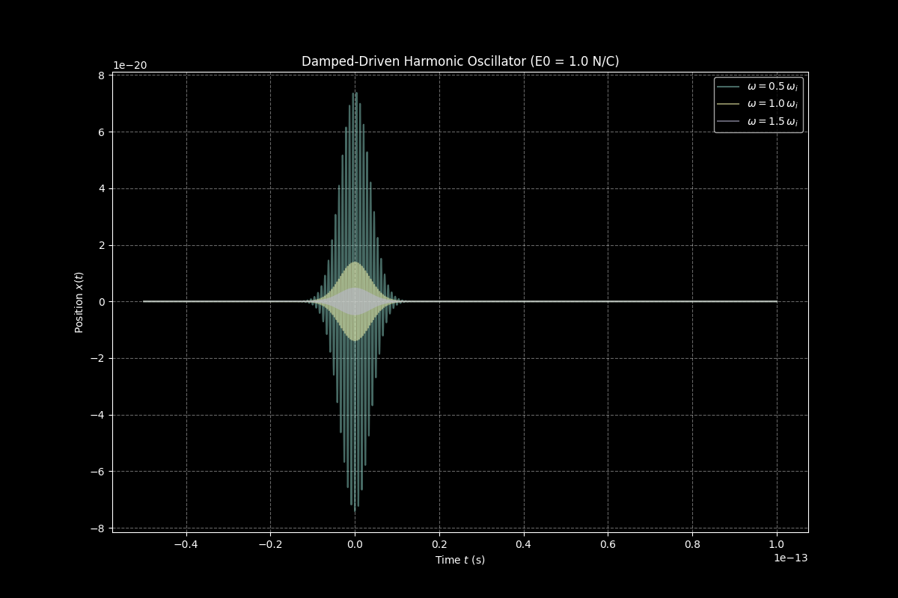

===========================
Physics Independent Studies
===========================

This repository contains assignments for the Independent Studies course. The topics covered include finite differencing methods and harmonic plots.

Contents
========

1. Finite Differencing
2. Dampened Oscillation

3. Zombie Apoclypse

4. Excitations hydrogen

.. image:: results/initialvalsimpleslab.png
   :width: 600
   :alt: Dielectric Simple slab waves snapshots

.. image:: results/dielectricdispersivelab.png
   :width: 600
   :alt: Dielectric Dispersive slab snapshots

Atomic Units Conversion for scaling
===================================

To convert a problem from SI units to atomic units, you use the following conversions:

Length:
-------
1 atomic unit of length = Bohr radius
a0 = 5.291772109 × 10^−11 m.

Energy:
-------
1 atomic unit of energy = Hartree
Eh = 4.359744722 × 10^−18 J.

Time (fs desired):
------------------
1 atomic unit of time = ℏ / Eh = 2.418884326 × 10^−17 s.

Electric Field:
---------------
1 atomic unit of electric field = Eh / (e0 a0) = 5.142206747 × 10^11 V/m.

Charge:
-------
1 atomic unit of charge = elementary charge
e0 = 1.602176634 × 10^−19 C.

Mass:
-----
1 atomic unit of mass = electron mass
me = 9.1093837015 × 10^−31 kg.